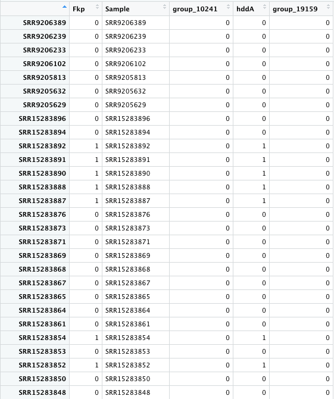

.. code-block:: R 

#################
# Title: add_gene.R
# Author- Renee Oles
# Purpose: R Script to find all the genes of a requirement and which samples they are in 
# Output: a dataframe that has a column for each gene fitting the requirement and which samples in which you could find that gene 
# Date- 9/23/2022
################

.. code-block:: R 

# Libraries
library(tidyverse)
library(data.table)

.. code-block:: R 

# Needed files
# metadata for all the samples including which phylogroup they are in 
groups <- read.delim("Other/metadata/group_with_phylogroup.txt",sep="\t")
# gene presence/absence from roary output
genes <- genes

.. code-block:: R 

# function which returns all the genes and which samples they are in given the input name
add_gene <- function(gene_name,new_name){
  if(gene_name %in% genes[,1]){fragilysin <- genes[genes[,1] == gene_name,]}
  else{fragilysin <- genes[genes$Annotation %like% gene_name,]}
  fragilysin[fragilysin == ""] <- 0
  rownames(fragilysin) <- fragilysin[,1]
  fragilysin <- fragilysin[,c(15:ncol(fragilysin))]
  fragilysin[fragilysin != 0] <- 1
  fragilysin <- mutate_all(fragilysin, function(x) as.numeric(as.character(x)))
  frag_sum <- as.data.frame(colSums(fragilysin))
  colnames(frag_sum)[1] <- rownames(fragilysin)[1]
  frag_sum$Sample <- rownames(frag_sum)
if(nrow(fragilysin)> 1){
  frag_sum <- cbind(frag_sum, t(fragilysin))
  colnames(frag_sum)[1] <- new_name
}
  return(frag_sum)
}

Running this command to find all the genes that contain the annotation "D-glycero-alpha-D-manno-heptose 7-phosphate kinase" and labeling the name as "Fkp" which is the name of the gene of interest gives the following dataframe: 

