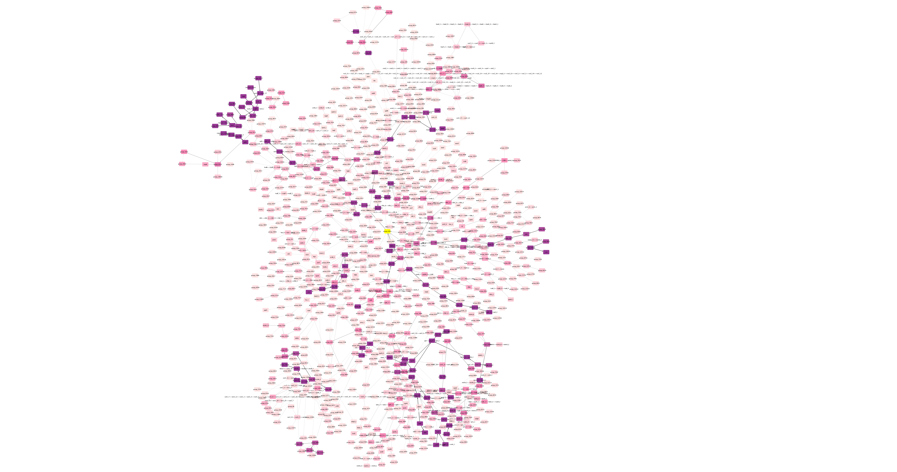
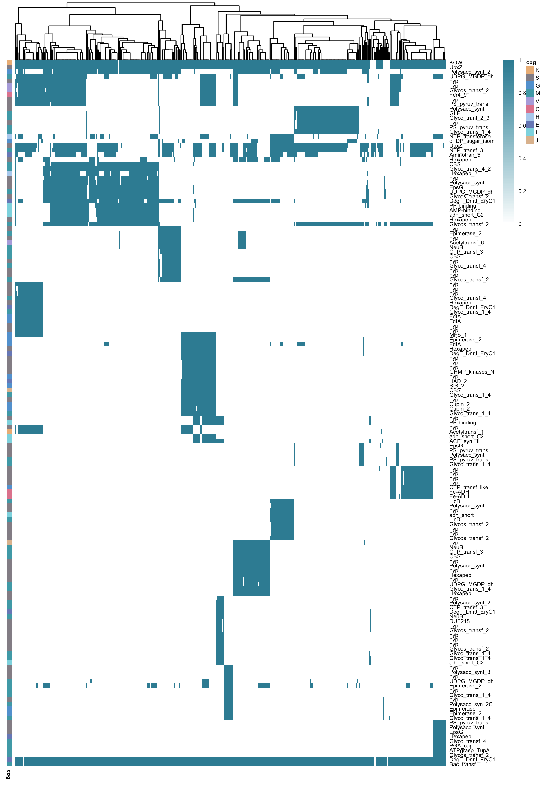

In pangenomics, one mechanism to study strain diversity is through graph traversal which allows you to find which genes are present or absent in an operon or gene cluster of interest. A graph representation of the pangenome is part of the output of the program, Panaroo. The graph represents the pangenome where each node is a gene and each edge represents the genes being adjacent on a contig in one or more of your samples. Through this output, it is possible to find every possible paths between two genes of interest within your samples.

As an example, the species, Bacteroides fragilis has a collection of capsular polysaccharide biosynthesis operons. The most studied one is called PSA. PSA coats the surface of the bacteria and interacts with the surrounding enviornment including immune cells in the human gut. The amount of variation in this molecule is remarkable, and we saught to describe this variation through graph traversal.

In this first image, we see the raw output of cytoscape where the highlighted node is the first conserved protein in this operon. 

In order to organize this graph so that the various gene paths can be readily observed. We created a script in python to traverse the graph from the starting node to the end node which is also conserved in all of the samples. 
This tool can be found `here <rolesucsd/Pangenomics/docs/source/graph_for_psa.py>`_

The tool will output every possible path along with the members in that path. The output may need to be manually currated to ensure that all paths represent an actual sequence observed in the samples. Some may be false positives as the filtering thresholds are set very low to make sure every possible path is captured.
After curating the paths, the paths can be annotated using this `R script <rolesucsd/Pangenomics/docs/source/operon_excel_from_graph_python.R>`_

This will output an excel file with each path annotated along with the phylogroup that the path is present in. After putting together all the possible combinations the path can be shown in a heatmap in R to see in which samples each of the paths is present in. 

