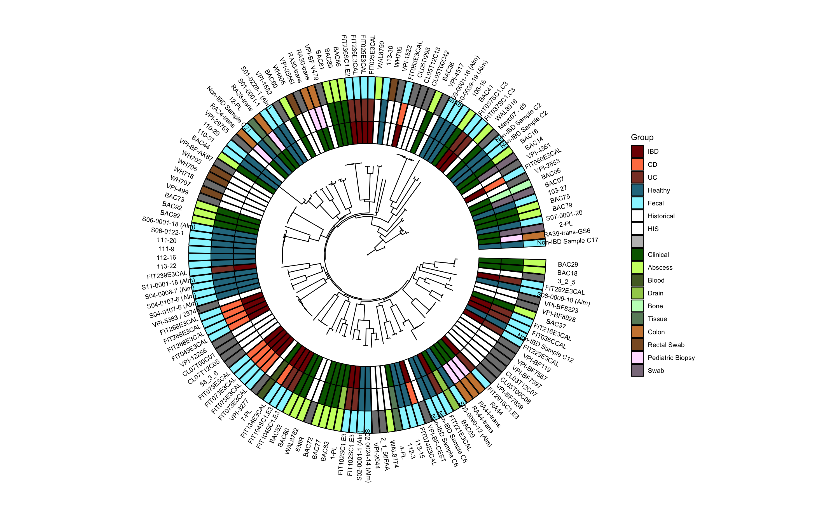

Pangenomics Tutorials
===================================

Studying bacterial isolates through pangenomics is a powerful way to capture species diversity. Studying a single type strain misses the extensive functional variation possible in a species. Through pangenomics, you can divide a species into representative clusters and study the full functional profile of a species, identifying how evolution drives changes in metabolism and immune cell interactions. These tutorial cover the initial formation of a pangenome as well as methods to analyze the product.

.. toctree::
   :maxdepth: 2
   :caption: Contents:

   self
   mash.rst
   upset.rst
   add_gene.rst
   snakemake.rst
