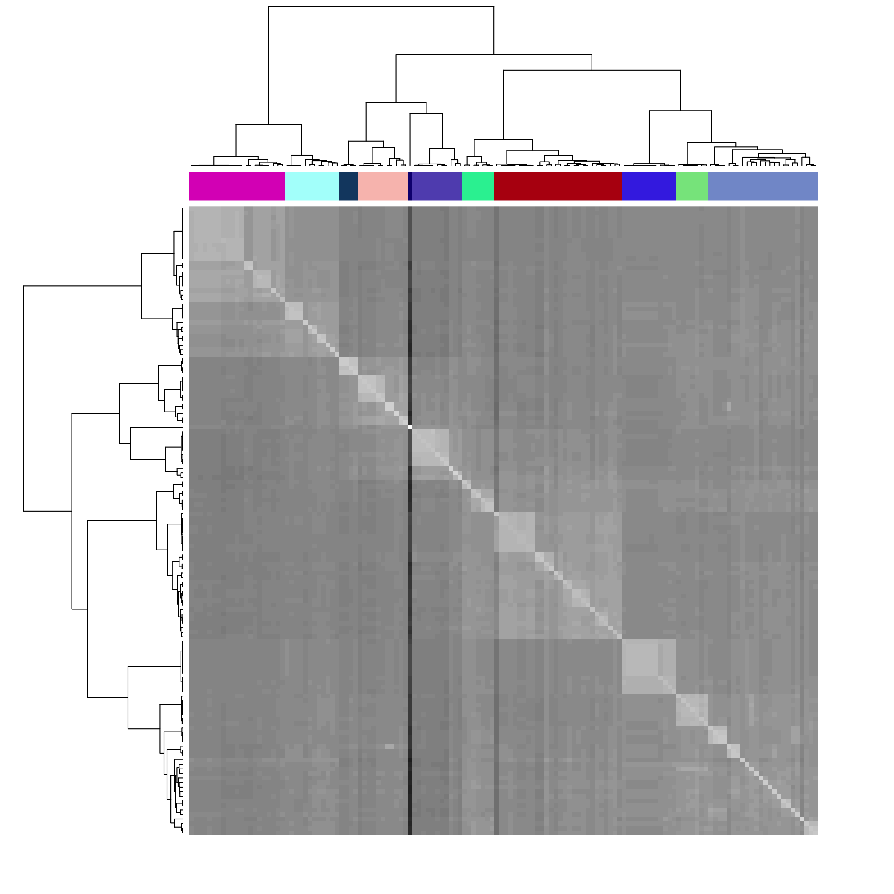

Phylogroup division with Mash
=============

This tutorial implements `Mash <https://github.com/marbl/Mash>`_ pylogroup division as created in `this source <https://doi.org/10.1038%2Fs42003-020-01626-5>`_.

1. Run MASH on files 

.. code-block:: python 

   conda install -c bioconda mash

After activating Mash you can run the following snakemake rule to run Mash on all assembly files in a directory

.. code-block:: python

    rule mash_fasta:
    input:
        expand("../Assembly/Shovill/{file}/{file}.fna", file=filtered)
    params:
        out="../MGWAS/Mash/fasta",
        pref="../Assembly/Shovill/"
    conda:
        "envs/mash.yml"
    output:
        "../MGWAS/Mash/fasta.tsv"
    shell:
        """
        mash sketch -s 10000 -o {params.out} {input}
        mash dist {params.out}.msh {params.out}.msh -t > {output}
        """

2. Create phylogroups through clustering the MASH matrix

This section will be conducted in R

First read the file in a dataframe in R 

.. code-block:: R

    mash <- read.csv("fasta.tsv", header=TRUE, row.names=1, sep="\t", check.names = FALSE)
Next cluster the mash file and produce a dendrogram

.. code-block:: R 

    dist<- as.dist(1-cor(t(mash)))
    hc1 <- hclust(dist, method = "ward.D2" )
    summary(hc1$height)
    plot(hc1, hang=-5, sub="", xlab="", labels=F)
To make phylogroups, we will cut the dendrogram at time height and this will produce the phylogroups

Create a dataframe with sample mapped to phylogroup

.. code-block:: R 

    phylogroup <- as.data.frame(cutree(hc1, h=max(hc1$height*0.125)))
    colnames(phylogroup) <- "phylogroup"
    phylogroup$Sample <- rownames(phylogroup)

Visualize the division through a heatmap of the matrix with the phylogroup as annotation

.. code-block:: R

    coul <- as.data.frame(randomColor(count=length(unique(phylogroup$phylogroup))))
    coul$phylogroup <- seq(1:nrow(coul))
    coul <- left_join(phylogroup,coul)
    colMain <- colorRampPalette(brewer.pal(8, "Greys"))(50)
    png(filename="phylogroup_mash.png", units="in", width=10, height=10, res=300)
    heatmap(as.matrix(mash), Rowv = as.dendrogram(hc1),Colv = 'Rowv', ColSideColors = coul[,2], labRow = FALSE, labCol = FALSE, col = colMain)
    dev.off()

