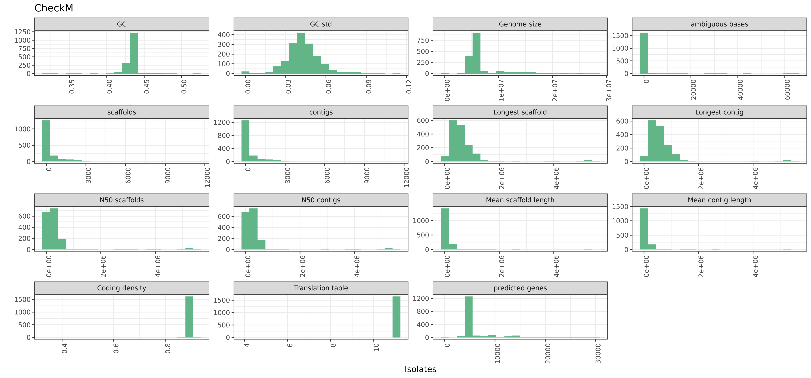

Snakemake pangenomics tutorial
=============

In this tutorial, we will walkthrough assembly to the creation of pangenomic graphics and microbial gwas. This tutorial is primarily suited to bacterial isolates.

PART 0: Folder structure

MainFolder

::

    mainfolder
    ├── snakemake
    │   ├── snakefile.smk
    │   ├── envs
    │   │   └── env.yml
    │   ├── config
    │   │   └── config.yml
    │   ├── logs
    │   ├── cluster.json
    │   └── scripts
    ├── Reference
    │   ├── file_R1.fastq
    │   └── file_R2.fastq
    ├── Assembly
    ├── Isoqual          
    └── Pangenome

PART 1: Assembly

For de-novo assembly, we will use Shovill, which is as of right now unpublished package that uses a combination of tools including the assembler Spades to do trimming, error correction, assembly at a variety of kmer lengths, as well as post-assembly correction. 

.. code-block:: python

    rule shovill:
    input:
        read1="../Reference/{file}_R1.fastq",
        read2="../Reference/{file}_R2.fastq"
    params:
        prefix="../Assembly/Shovill/{file}",
        tmp="../tmp/{file}"
    log:
        "log/spades_isolate_{file}.log"
    conda:
        "envs/shovill.yml"
    output:
        "../Assembly/Shovill/{file}/contigs.fa"
    shell:
        """
        shovill --nocorr --force --tmpdir {params.tmp} --outdir {params.prefix} --R1 {input.read1} --R2 {input.read2} &> {log}
        """

Other parameters that you may want to add -
    --noreadcorr - skips read correction
    --nocorr - skips read correction and pilon correction
    --trim - indicates that the files should be trimmed

After assembly, the assembly should be filtered so that the minimum contig length is 500. This prevents gene fragments from being incorporated into the pangenome. 

.. code-block:: python

    rule contig_filter:
    input:
        assembly="../Assembly/Shovill/{file}/contigs.fa"
    params:
        contig=500
    conda:
        "envs/bbmap.yml"
    log:
        "log/prokka_filter_{file}.log"
    output:
        fna="../Assembly/Shovill/{file}/{file}.fna"
    shell:
        "reformat.sh in={input} out={output} minlength={params} &> {log}"

PART 2: Assembly Quality Control 

Assemblies need to be checked for contamination and completness before creating a pangenome. Although isolates are assumed to be a specific organism, it is very likely that several of the files either are not the organism you expect, or they have some contamination from other organisms. It is crucial to identify these things before moving to the next step.

CheckM is a tool to asses the contamination and completeness of each assembly; running it separately with snakemake is much faster than running all the assemblies together. It takes about 5 minutes to run per sample with these parameters. 

.. code-block:: python

    rule run_checkm:
    input:
        binset="../Assembly/Shovill/{file}/{file}.fna"
    params:
        threads=40,
        out="../Assembly/Shovill/{file}"
    output:
        lineage="../Assembly/Shovill/{file}/lineage.ms",
        log="../Assembly/Shovill/{file}/lineage.log",
        stats="../Assembly/Shovill/{file}/storage/bin_stats.analyze.tsv"
    conda:
        "envs/checkm.yml"
    log:
        log="../Assembly/Shovill/{file}/lineage.log"
    shell:
        """
        checkm lineage_wf -t 20 -x fna {params.out} {params.out} &> {log}
        """

Using custom scripts, the checkm output will be compiled and represented in a singular file for processing downstream. All these scripts are available in the scripts folder on github.

.. code-block:: python

    rule checkm_to_graph:
    input:
        stats=expand("../Assembly/Shovill/{file}/storage/bin_stats.analyze.tsv", file=reads),
        log=expand("../Assembly/Shovill/{file}/lineage.log", file=reads)
    output:
        png="../Isoqual/checkm_log.txt",
        stats="../Isoqual/checkm_stats.txt"
    conda:
        "envs/r.yml"
    shell:
        """
        Rscript scripts/checkm-log.R {input.log}
        Rscript scripts/checkm_bin-stats.R {input.stats}
        """

After checkM, we will check to make sure the assemblies are within a reasonable identity to the reference using fastANI.

.. code-block:: python

    rule fastani_list_create:
    input:
        fasta=expand("../Assembly/Shovill/{file}/{file}.fna", file=reads),
        ref = config["reference_fna"]
    output:
        "../Isoqual/fastani_list.txt"
    shell:
        "scripts/create_list.sh {input}"

After creating a list for input into FastANI, run FastANI with the following command

.. code-block:: python

    rule fastani:
    input:
        "../Isoqual/fastani_list.txt"
    output:
        "../Isoqual/matrix.txt"
    conda:
        "envs/fastani.yml"
    shell:
        "fastANI --ql {input} --rl {input} -o {output} -t 20"

Convert the fastANI matrix to a edited heatmap as well as graphic output. 

.. code-block:: python

    rule fastani_to_graph:
    input:
        "../Isoqual/matrix.txt"
    output:
        png="../Isoqual/ani.png",
        txt="../Isoqual/matrix_edit.txt"
    shell:
        """
        python -m pip install seaborn
        python scripts/long_to_wide.py {input} {output.txt}
        python scripts/heatmap_ani.py {output.txt} {output.png}
        """

The quality metrics can be viewed through images produced by the proceeding scripts. 

THe last snakemake block for quality control will take all the information above to create a list of all the samples that pass all the user-defined thresholds

.. code-block:: python
    rule filter_files:
    input:
        ani="../results/matrix_edit.txt",
        checkm="../results/checkm_log.txt",
        stat="../results/checkm_stats.txt"
    params:
        ref="9343",
        gc=43.19,
        genome_size=5205140
    output:
        "sample_list_bin.txt"
    shell:
        "python scripts/filter_isolates.py -o {output} -a {input.ani} -l {input.checkm} -s {input.stat} -r {params.ref} -gc {params.gc} -g {params.genome_size}"

PART 3: Create Pangenome

After the isolates passing the thresholds are written to a file, this file can be used to define the input for the next pipeline which is creation of the pangenome. The tool we use here is Panaroo, which is very similiar to Roary.
