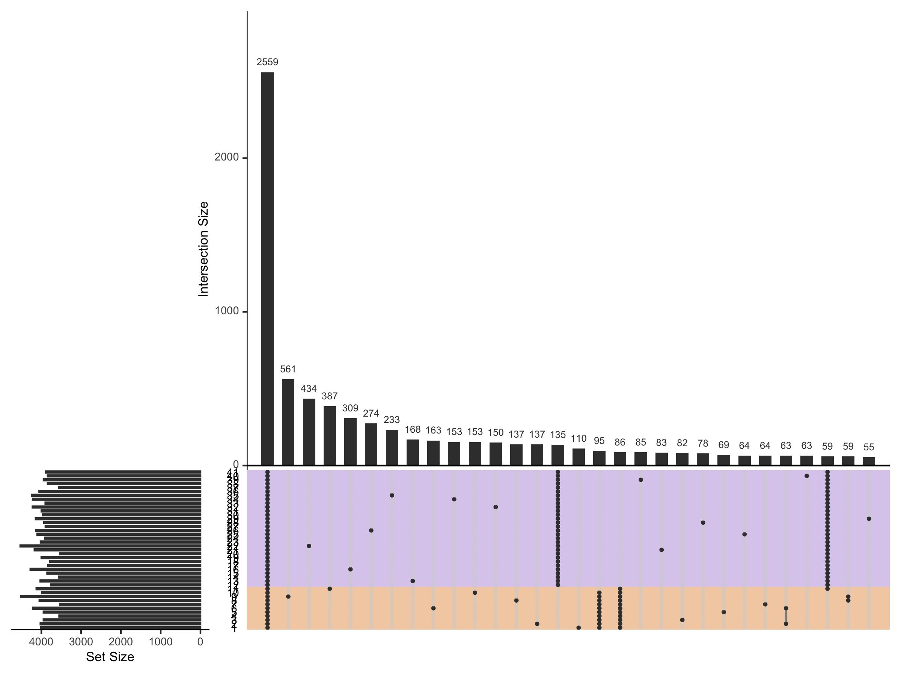

Upset tutorial
=============

Upset is a method of visualizing intersections when a Venn Diagram would not be appropriate, ie when you want to compare more than 4 groups. In this case, I want to compare the gene content of 40 phylogroups. 
In [] tutorial I have shown how to create phylogroups and how to summarize a gene presence/absence table from Roary or Panaroo. Now we can visualize the pangenome of these phylogroups using upset.

.. code-block:: R

    library(UpSetR)
    genes_list <- genes_phylo_perc[,2:(ncol(genes_phylo_perc))]/100
    genes_list <- round(genes_list)
    genes_list <- genes_list[rowSums(genes_list[])>0,]
    metadata <- data.frame(Phylogroup=seq(1,41),Division=c(rep(2,11),rep(1,30)))

    upset(genes_list, sets=metadata$Phylogroup, point.size = 1, text.scale = 1, line.size=0.3, order.by = "freq", nintersects=30, 
      keep.order = TRUE, set.metadata = list(data = metadata, plots = list(list(type = "matrix_rows", 
      column = "Division", colors = c("1" = "#b79adb", "2"= "#e89e54"), alpha = 0.5))))

Producing the following image

   :alt: Upset of phylogroups
   :align: center
